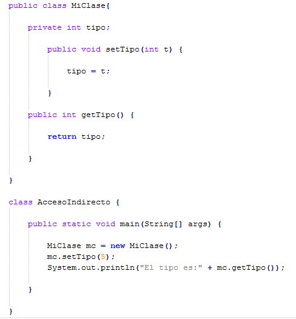
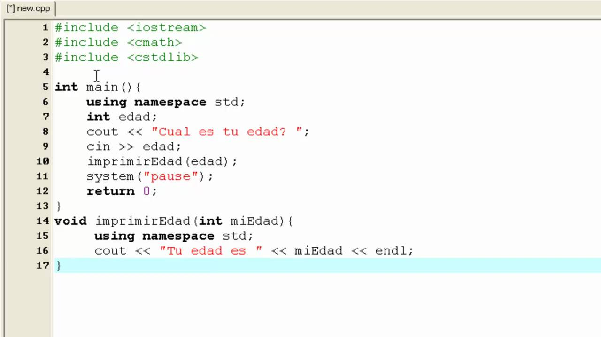
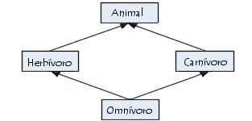
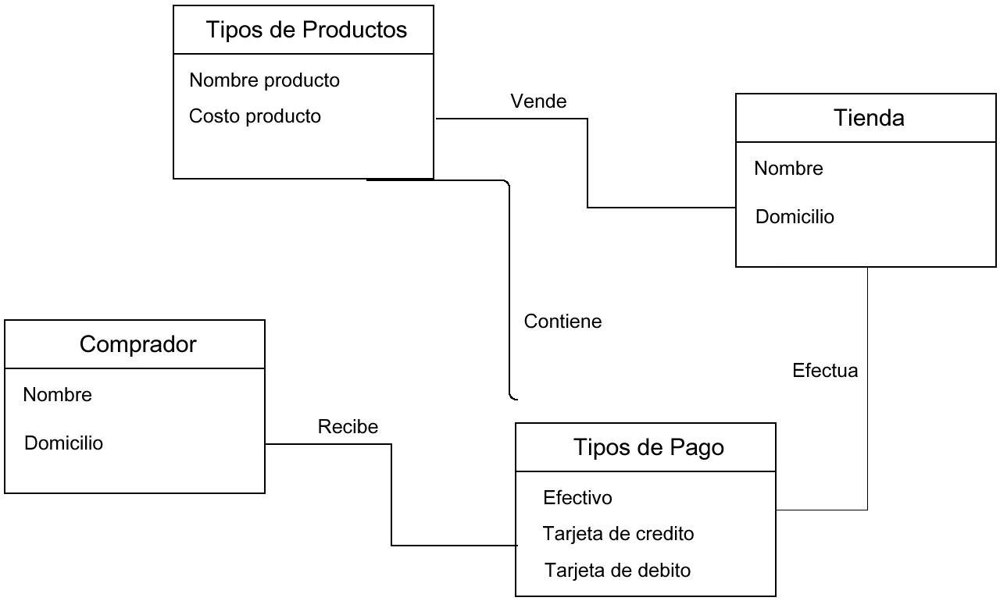

# Tarea I

## Melchor Cancino Luis Angel 18212221

===========================================

### Paradigma

Es como mostrar como va a ser la ejecución de un programa, como se debe estructurar las tareas para que se ejecute el programa.

===========================================

### Abstraccion

Son como las propiedades que distinguen a los demás objetos para que sean unicos.
**Ejemplos**

1. Plantas (Es abstracto, por ejemplo si fuese "Rosa" ahi ya no sería abstracto porque ya sabemos a que se refiere)
2. Aves (Tambien es abstracto, si fuese "Aguila" ahi ya sabemos que es)

===========================================

### ¿Por qué decimos que la Clase es el mecanismo de abstraccion de los lenguajes Orientado a Objetos

Porque contiene consigo objetos, y cada clase debe tener como un nombre mas general sobre las cosas.

===========================================

### Explica el concepto de encapsulamiento, busca dos imágenes que te ayuden a describir el concepto, una que tenga algún sistema sin encapsulamiento y otra donde si lo tenga. Menciona por que es importante y que problemas puede evitar

El encapsulamiento organiza los datos y garantiza la "seguridad" de los datos que contiene un objeto, estos pueden ser publicos, privados o protegidos.

#### Con encapsulamiento:

Aqui podemos ver un sistema con encapsulamiento, es importante ya este oculta su interior protegiendo la integridad de los datos, tambien, para que sea mas facil para el programador ya que reduce su complejidad, es mas sencillo encontrar errores.

..

#### Sin encapsulamiento:

Si decidimos no encapsular, el programa estaría propenso a errores, ademas de que estaremos inseguros a posibles cambios.

## Describe con tus palabras el concepto de herencia e ilustra el concepto con imágenes

#### Herencia:

Esta función permite que se creen objetos a partir de objetos que ya existen, obteniendo asi sus propiedades.

..

.. 

**UML: Diagrama de clases**

#### 1. Investiga la historia y haz un resumen del Lenguaje de Modelado Unificado, donde se mencione: quienes son sus principales autores (Booch, Rumbaugh, Jacobson), en que tipo de sistemas se utiliza, en particular el Diagrama de Clases. Menciona algunas de las herramientas para el modelado en UML. ¿Sabes de alguna empresa local que utilice este lenguaje?

El Lenguaje Unificado de Modelado (UML) fue creado para forjar un lenguaje de modelado visual común y semántica y sintácticamente rico para la arquitectura, el diseño y la implementación de sistemas de software complejos, tanto en estructura como en comportamiento. UML tiene aplicaciones más allá del desarrollo de software, p. ej., en el flujo de procesos en la fabricación.

Es comparable a los planos usados en otros campos y consiste en diferentes tipos de diagramas. En general, los diagramas UML describen los límites, la estructura y el comportamiento del sistema y los objetos que contiene.

UML no es un lenguaje de programación, pero existen herramientas que se pueden usar para generar código en diversos lenguajes usando los diagramas UML. UML guarda una relación directa con el análisis y el diseño orientados a objetos.

The Three Amigos" (los tres amigos) de la ingeniería de software, como se los conocía, habían desarrollado otras metodologías. Se asociaron para brindar claridad a los programadores creando nuevos estándares. La colaboración entre Grady, Booch y Rumbaugh fortaleció los tres métodos y mejoró el producto final.

#### Usos de los diagramas de clases

Se utilizan para modelar la vista estática de un sistema, muestra principalmente los requisitos funcionales de un sistema y los servicios que el sistema debe proporcionar a sus usuarios finales

*Personalmente* ***NO*** *conozco una empresa que utilice ese metodo*

#### 2. Escribe una propuesta de una máquina que venda distintos artículos y haz el diagrama de clases del sistema que propones

